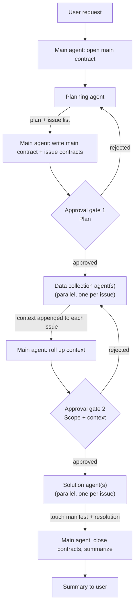

# Contract Workflow

A task moves through four roles, each a separate delegated agent, coordinated by you (the "main
agent") via written **contracts** — markdown files that are the source of truth for what each stage
found and did. You never skip a role's work yourself; you delegate, read the contract it produced,
gate on approval where required, and move to the next stage.



## Folder layout

Created inside the current project (never in `~/.claude`):

```
.claude/
  contracts/<task-slug>/main.md     # one per user request — the running record + approvals
  issues/NNNN-<slug>.md             # one per distinct problem, numbered sequentially across the whole repo
```

Templates: [main-contract-template.md](references/main-contract-template.md) and
[problem-contract-template.md](references/problem-contract-template.md).

**Issue numbering**: scan `.claude/issues/*.md` for the highest `NNNN` prefix already used anywhere
in the repo (not per-task) and take `max + 1`, zero-padded to 4 digits. Numbers are never reused, even
if an issue is later abandoned.

## Stage 1 — Planning

1. Slugify the user's request, create `.claude/contracts/<slug>/main.md` from the template, fill in
   the verbatim **Request** section, status `planning`.
2. Delegate to a **Planning agent** (Agent tool, `subagent_type: "Plan"`, foreground — you need its
   result before continuing). Prompt it with the full user request, point it at the repo, and ask for:
   an approach/plan, and an enumerated breakdown into **independent, individually-completable issues**
   (each with a one-line problem statement and the files it's likely to touch).
3. Write the returned plan into main.md's **Plan** section. Do not create issue contract files yet —
   that happens after approval.

## Approval gate 1 — Plan

Use AskUserQuestion: summarize the plan and the proposed issue breakdown, ask the user to approve or
request changes. On changes requested, re-run Stage 1 with their feedback folded into the Planning
agent's prompt. Do not proceed past this gate silently — this is a hard checkpoint, not a formality.

## Stage 2 — Issue contracts + parallel data collection

1. On approval, for each issue from the plan: allocate the next issue number, write
   `.claude/issues/NNNN-slug.md` from the template with **Problem** and **Acceptance criteria** filled
   in. Update main.md's **Linked issues** list and set status `context-gathering`.
2. Delegate one **Data collection agent** per issue, all launched in parallel in a single message
   (Agent tool, `subagent_type: "Explore"`, background is fine — read-only and independent of each
   other). Each agent's prompt: read its issue file, investigate the codebase for the relevant
   existing code, tests, constraints, and prior art, then **edit the issue file itself** to fill in
   its **Context** section, and report back a short summary.
3. Once all return, roll up a short aggregate into main.md's **Context summary** section. Status
   `context-gathered`.

## Approval gate 2 — Scope + context

AskUserQuestion again: present the finalized issue list plus the aggregated context, ask the user to
approve moving into fixes or request changes (which loops back into Stage 2). This gate exists so the
user signs off on scope _before_ any code is touched, not after.

## Stage 3 — Parallel solution + touch manifests

1. Before dispatching, check every issue's likely files (from Stage 1/2) for overlaps. Issues that
   share a file must run **sequentially** relative to each other; issues with disjoint files run in
   parallel. This is the one safety rule that matters here — two parallel agents editing the same file
   is exactly the failure mode this workflow exists to prevent.
2. Delegate one **Solution agent** per issue (Agent tool, `subagent_type: "general-purpose"`, since it
   needs Edit/Write; parallel where the overlap check allows it). Prompt it to:
   - Read its issue file (problem, acceptance criteria, gathered context).
   - **Before editing anything**, write a **Touch manifest** into the issue file: every file path it
     will touch and the approximate line range/region within each — this is what keeps the edit small
     and lets you verify no overlap actually occurred.
   - Make the fix strictly within that manifest, in the smallest accurate chunk that satisfies the
     acceptance criteria. No drive-by refactors, no touching files outside the manifest.
   - Write a **Resolution** section into the issue file: what changed, the actual files/lines touched
     (should match the manifest), and test status if applicable. Report the same back to you.
3. Mark each issue `resolved` as its Solution agent returns. Update main.md's **Final summary**
   (per-issue: what changed, files/lines touched, tests) and set status `resolved`.

## Final report

Report the summary to the user directly in your response — per issue, what changed and where — not
just "see the contract files." The contracts are the audit trail; the chat response is what the user
actually reads.

## Rules

- Never let a Solution agent touch a file outside its own declared touch manifest.
- Never skip an approval gate, even if the plan looks obviously right — the gates are the point.
- Contracts are append-only records of what happened; don't rewrite history in them, add new sections.
- This workflow edits and creates files; it never commits or pushes on its own. Committing follows
  whatever the project's own git conventions say (see the project's CLAUDE.md if present).
